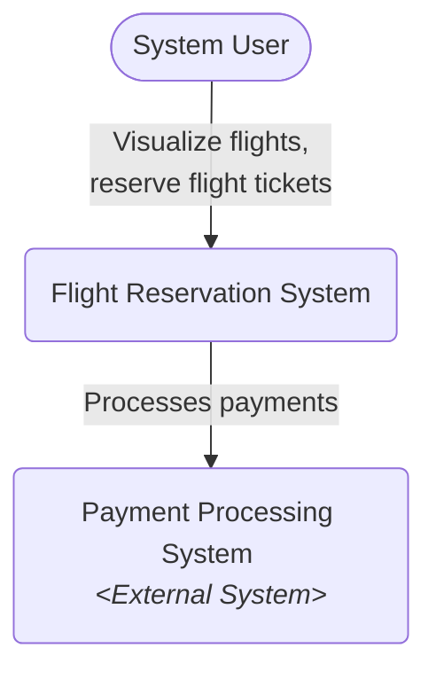
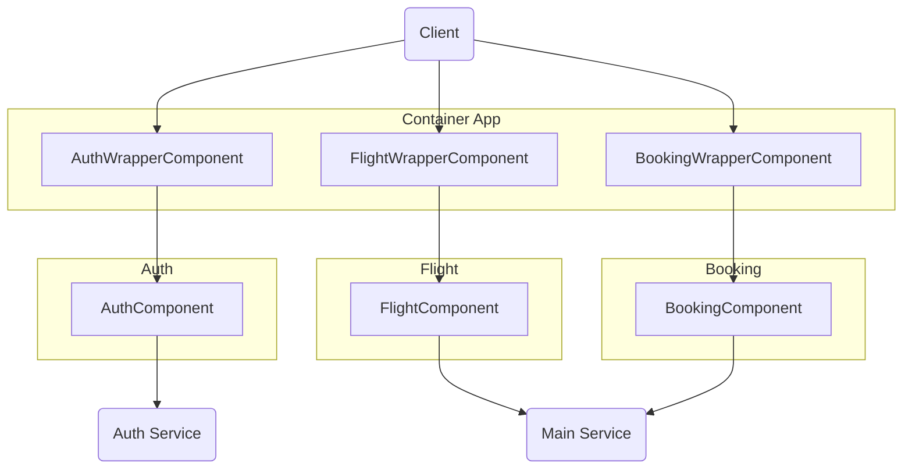
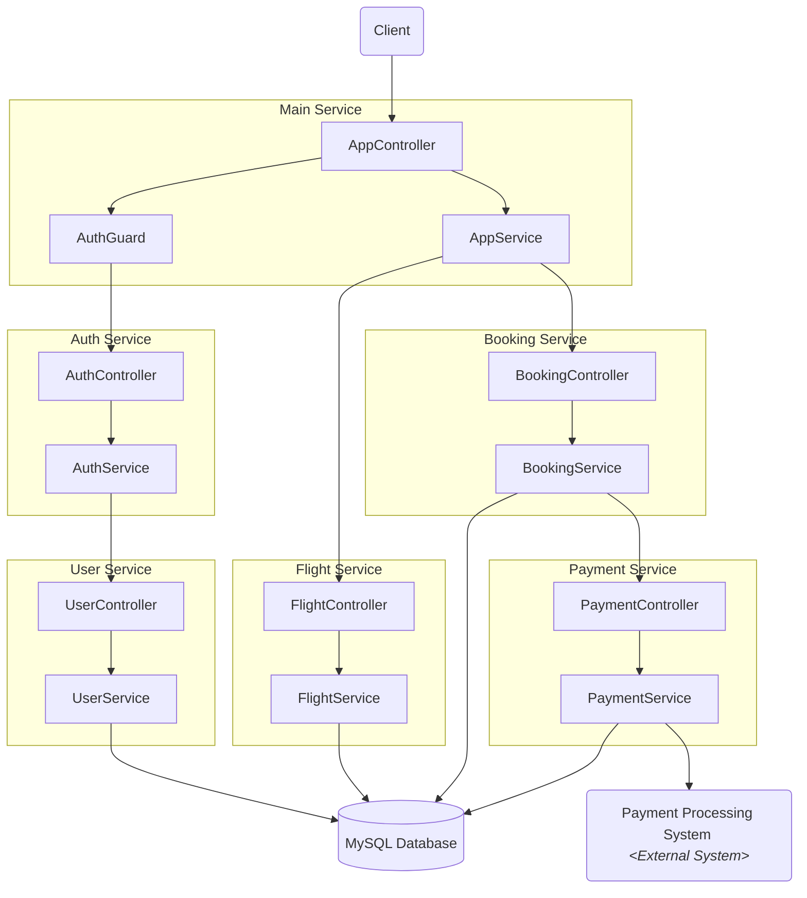
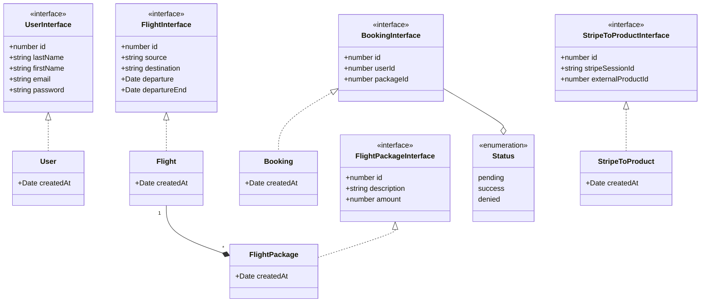

# SOA-Project - Flight Reservation System
### System Diagram

```mermaid
graph TD
  User([System User])--Visualize flights, \n reserve flight tickets-->System(Flight Reservation System)
  System --Processes payments --> paymentSys("Payment Processing System \n<i>#lt;External System#gt;</i>")
```

### Container Diagram

```mermaid
graph TD
  User([System User])
  paymentSys("Payment Processing System \n<i>#lt;External System#gt;</i>")
  backend(Main Service)
  backendAuth(Auth Service)
  backendUser(User Service)
  backendFlight(Flight Service)
  backendBooking(Booking Service)
  backendPayment(Payment Service)
  
  User--"Visualize flights and reserve flight tickets"-->WebApp(Web Application)
  backendPayment --Processes payments --> paymentSys("Payment Processing System \n<i>#lt;External System#gt;</i>")
  
  subgraph container[Flight Reservation System]
    direction LR
    WebApp--Call API-->backend
    WebApp--Call API-->backendAuth
    backendAuth --> backendUser
    backend --Check JWT-->backendAuth
    backend -->backendFlight
    backend -->backendBooking
    backendBooking-->backendPayment
  end
```

### Component Diagram
#### Web Application

```mermaid
graph TD
    Client(Client)-->AuthWrapperComponent
    Client-->FlightWrapperComponent
    Client-->BookingWrapperComponent
    subgraph container[Container App]
      AuthWrapperComponent
      FlightWrapperComponent
      BookingWrapperComponent
    end
    subgraph Auth
      AuthComponent
    end
    subgraph Flight
      FlightComponent
    end
    subgraph Booking
      BookingComponent
    end
    AuthComponent-->AuthService(Auth Service)
    AuthWrapperComponent -->AuthComponent
    FlightWrapperComponent-->FlightComponent-->MainService(Main Service)
    BookingWrapperComponent-->BookingComponent-->MainService
```

#### Services

```mermaid
graph TD
    Client(Client)-->AppController
    AppService
    AuthGuard
    subgraph main[Main Service]
      AppController --> AppService
      AppController --> AuthGuard
    end
    AppService-->FlightController
    AppService-->BookingController
    AuthGuard-->AuthController
    AuthService
    subgraph auth[Auth Service]
      AuthController --> AuthService
    end
    AuthService-->UserController
    UserService
    subgraph user[User Service]
      UserController --> UserService
    end
    UserService-->database[(MySQL Database)]

    FlightService
    subgraph flight[Flight Service]
      FlightController --> FlightService
    end
    FlightService-->database[(MySQL Database)]
    
    BookingService
    subgraph booking[Booking Service]
      BookingController --> BookingService
    end
    BookingService-->database[(MySQL Database)]
    BookingService-->PaymentController
    
    PaymentService
    subgraph payment[Payment Service]
      PaymentController --> PaymentService
    end
    PaymentService-->database[(MySQL Database)]
    PaymentService-->paymentSys("Payment Processing System \n<i>#lt;External System#gt;</i>")
```

### Code

```mermaid
classDiagram
    UserInterface<|..User
    FlightInterface<|..Flight
    BookingInterface<|..Booking
    FlightPackageInterface<|..FlightPackage
    StripeToProductInterface<|..StripeToProduct
    
    class UserInterface{
    <<interface>>
    +number id
    +string lastName
    +string firstName
    +string email
    +string password}
    
    class User{
    +Date createdAt}
    
    class FlightInterface{
    <<interface>>
    +number id
    +string source
    +string destination
    +Date departure
    +Date departureEnd}
    
    class Flight{
    +Date createdAt}
    
    class FlightPackageInterface{
    <<interface>>
    +number id
    +string description
    +number amount
    }
    
    class FlightPackage{
    +Date createdAt}
    
    class BookingInterface{
    <<interface>>
    +number id
    +number userId
    +number packageId
    }
    
    class Booking{
    +Date createdAt}
    
    class Status{
    <<enumeration>>
    pending
    success
    denied}
    
    class StripeToProductInterface{
    <<interface>>
    +number id
    +string stripeSessionId
    +number externalProductId
    }
    
    class StripeToProduct{
    +Date createdAt}
    
    Flight  "1" --* "*" FlightPackage
    BookingInterface --o Status
    

```
