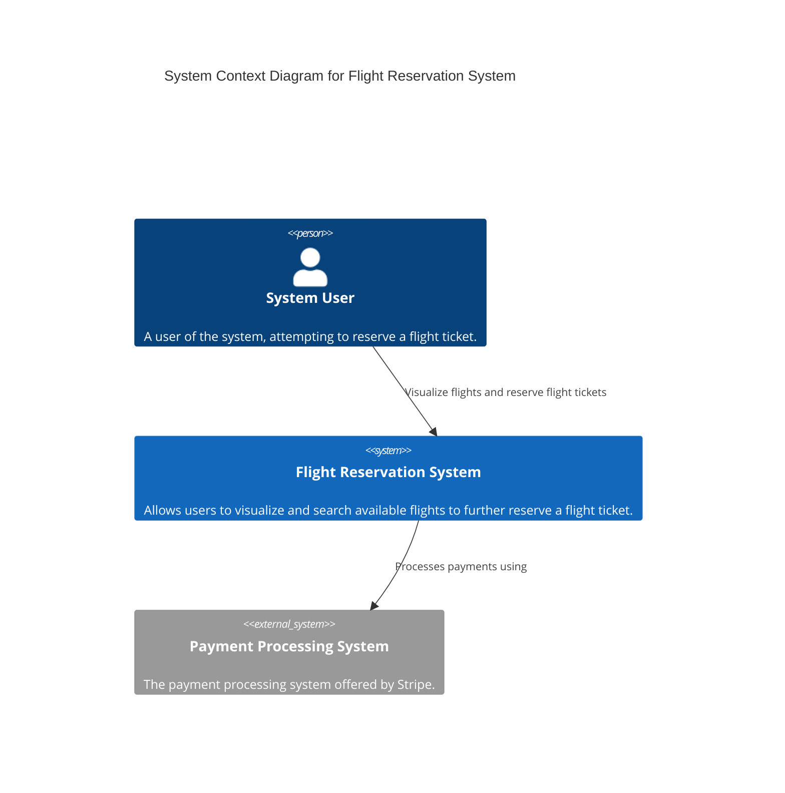
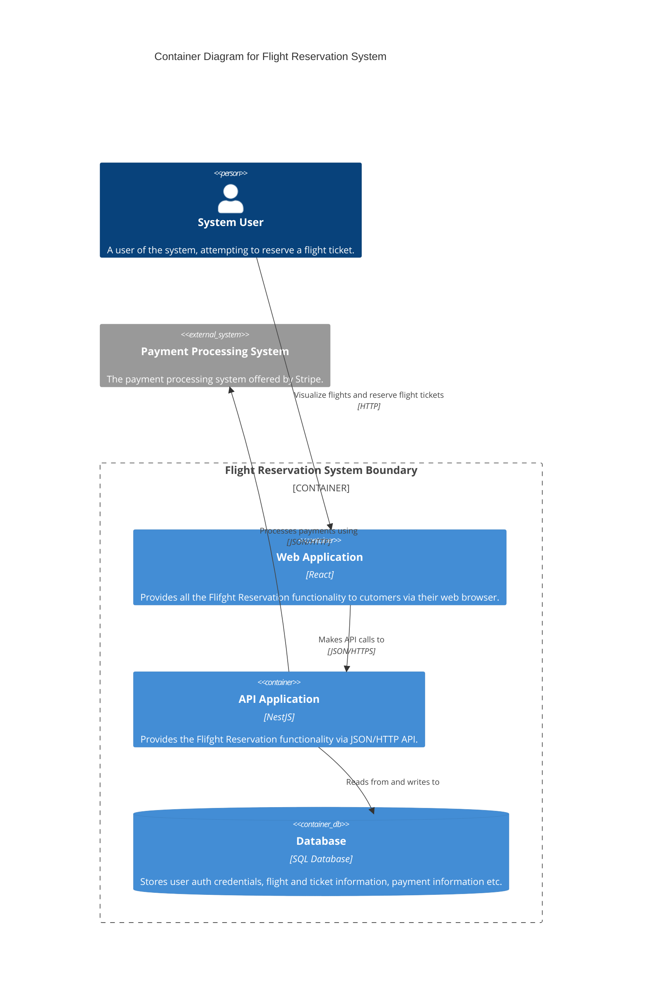

# SOA-Project - Flight Reservation System
## System Diagram

```mermaid
  C4Context
    title System Context Diagram for Flight Reservation System
    Person(user, "System User", "A user of the system, attempting to reserve a flight ticket.")
    System(flightReservationSystem, "Flight Reservation System", "Allows users to visualize and search available flights to further reserve a flight ticket.")
    System_Ext(paymentSystem, "Payment Processing System", "The payment processing system offered by Stripe.")
    
    Rel(user, flightReservationSystem, "Visualize flights and reserve flight tickets")
    Rel(flightReservationSystem, paymentSystem, "Processes payments using")
    
    UpdateLayoutConfig($c4ShapeInRow="1")
```

## Container Diagram

```mermaid
   C4Context
    title Container Diagram for Flight Reservation System
    Person(user, "System User", "A user of the system, attempting to reserve a flight ticket.")
    Container_Boundary(b, "Flight Reservation System Boundary") {
      Container(webApp, "Web Application", "React", "Provides all the Flifght Reservation functionality to cutomers via their web browser.")
      Container(backend, "API Application", "NestJS", "Provides the Flifght Reservation functionality via JSON/HTTP API.")
      ContainerDb(database, "Database", "SQL Database", "Stores user auth credentials, flight and ticket information, payment information etc.")
    }
    System_Ext(paymentSystem, "Payment Processing System", "The payment processing system offered by Stripe.")
    
    Rel(user, webApp, "Visualize flights and reserve flight tickets", "HTTP")
    Rel(backend, paymentSystem, "Processes payments using", "JSON/HTTP")
    Rel(webApp, backend, "Makes API calls to", "JSON/HTTPS")
    UpdateRelStyle(webApp, backend, $offsetX="-45")
    
    Rel_Back(database, backend, "Reads from and writes to")
```
